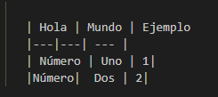
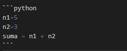

# Manual para Md
## Encabezados
Para  crear un encabezado en markdown, se utiliza el símbolo `#` seguido del texto que queremos mostrar.
* Por ejemplo:
`#Título 1`
`##Título 2`
`### Título 3`

# Título 1
## Título 2
### Título 3

## Texto básico
Para aplicar negrita al texto, se escribe entre dos asteriscos. Para aplicar cursiva al texto, se escribe entre un solo asterisco:
* **holaMundo**
* *holaMundo*

## Listas numeradas
Para crear listas numeradas, empiece una línea con 1. 
1. lista_1
2. Lista_2

## listas con viñetas
Para crear listas de viñetas, empiece una línea con *, + o - y luego el texto.
* `* Viñeta  1`
* `+ Viñeta 2`
* `- Viñeta 3`

## Crear una  tabla
Para crear una tabla, usa barras verticales | para separar columnas y guiones entre los encabezados y el resto del contenido de la tabla. Las barras verticales son sólo estrictamente necesarias entre columnas.



   | Hola | Mundo | Ejemplo 
   |---|---| --- |
   | Número | Uno | 1|
   |Número|  Dos | 2|

## Hacer una nota
`>[!NOTE]`

`>`

`>Esta es una nota importante.`

>[!NOTE]
>
>Esta es una nota importante.

## Imágenes
Para agregar una imagen, primero se usa !, seguido de un texto alternativo entre corchetes, seguido a su vez por el URL de la imagen y un título opcional entre comillas.

   ``

   

## Vínculos
Situar entre corchetes el texto que se quiere enlazar. Seguidamente, se debe usar paréntesis para definir la URL a la que debe enlazar en texto del enlace:

`[Perfil de Git](https://github.com/IsabelTovar08)`

[Perfil de Git](https://github.com/IsabelTovar08)

## Agregar bloques de código
Para lograr esto, comience su bloque con una línea de tres comillas invertidas, seguido del lenguaje que está utilizando. Esto le señala a Markdown que está creando un bloque de código. Necesitará finalizarlo con otra línea de tres comillas invertidas. Por ejemplo:

 

```python
n1=5
n2=3
suma = n1 + n2
```
